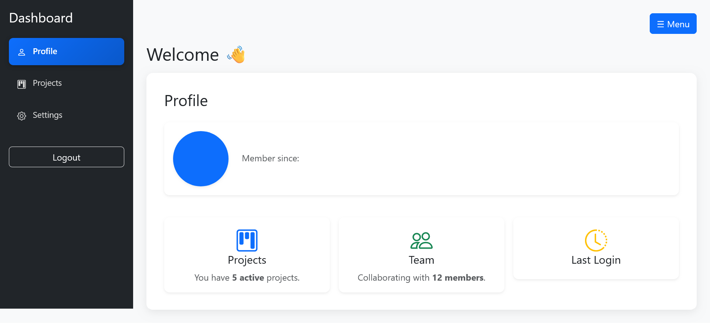
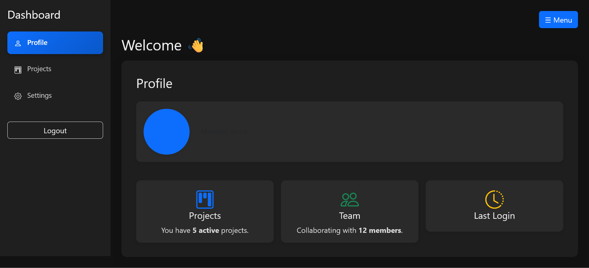
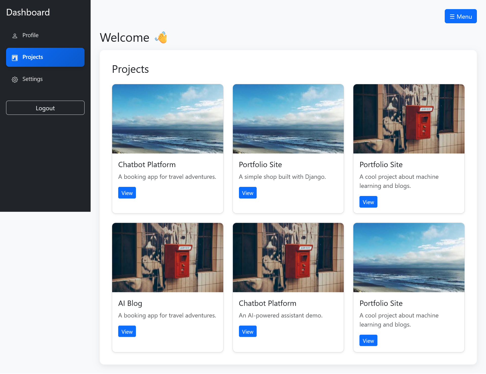

# Django SPA Simulation with Bootstrap Tabs

This project demonstrates how to simulate a **Single Page Application (SPA)** feel in Django using **Bootstrap tabs**.

## 🚀 Features
- Tab-based navigation without full page reloads
- Clean Django template structure with partials
- Lightweight, no heavy frontend framework required

## 📸 Demo


**Profile Tab Light Mode**


**Profile Tab Dark Mode**


**Project Tab**


## ⚙️ Setup
```bash
git clone https://github.com/ndmichael/team_dashboard.git
cd team_dashboard
pip install -r requirements.txt
python manage.py migrate
python manage.py runserver
